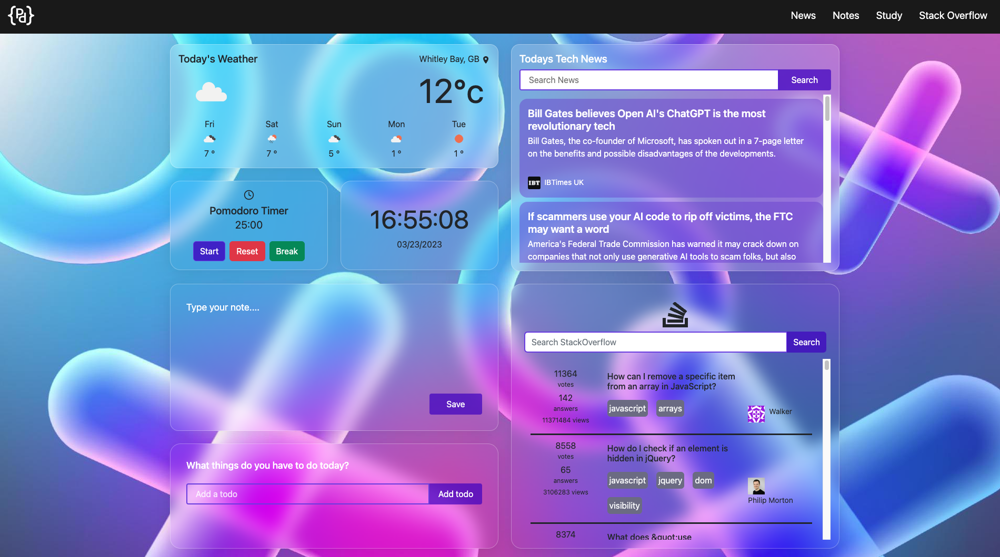
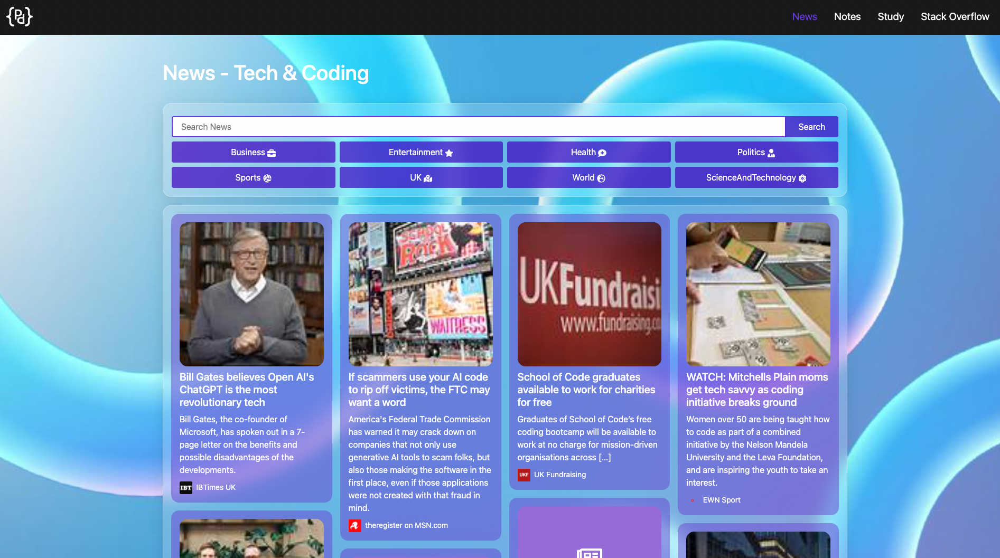
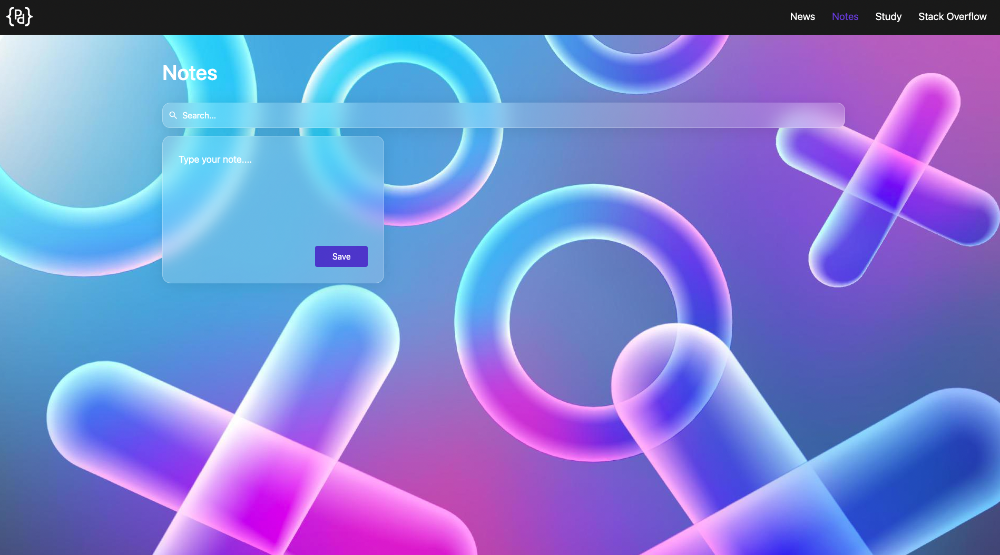
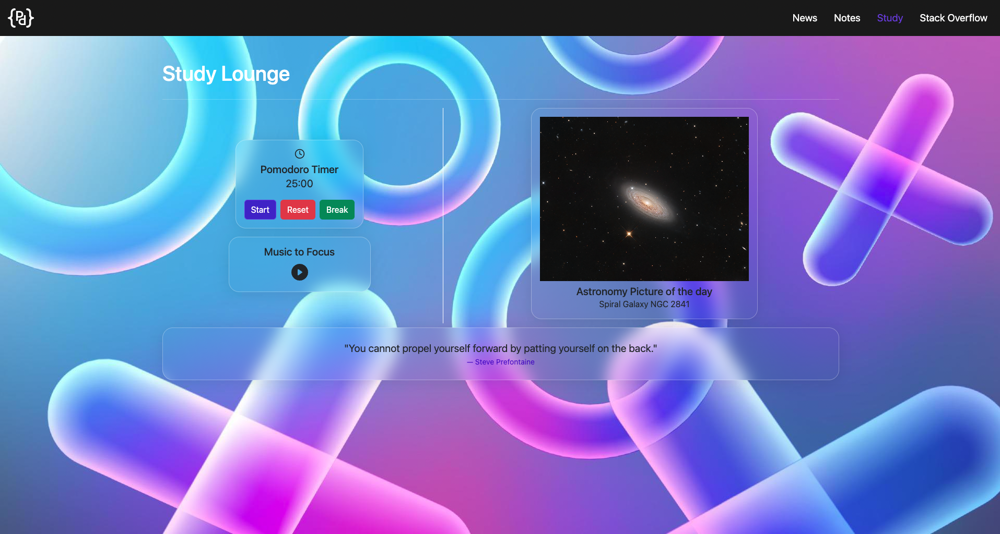
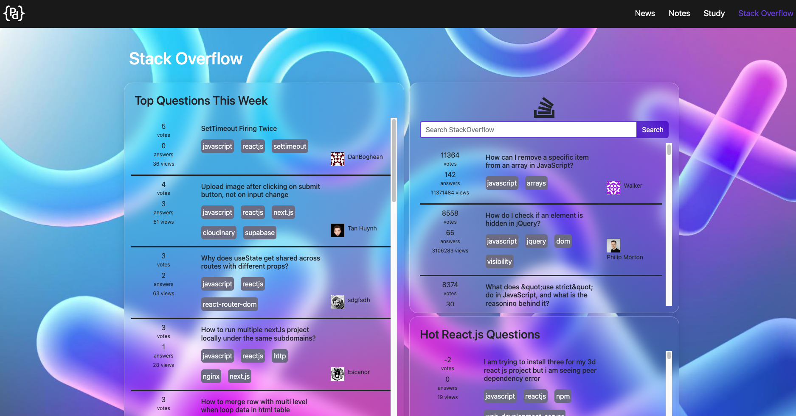

# Productive Programming

Link to deployed site: https://productive-programming.netlify.app 

## Description 
Welcome to the repo!  Productive programming is a single page application for developers and students. It includes features such as a current and forecasted weather widget, programming news, a search function for Stack Overflow, a Pomodoro timer and the ability to add and save notes and todos. 

This project was a collaborative venture (contributors listed below). As a team, we practiced agile development where our first objective was to create a MVP (minimum viable product). This entailed the implementation of core features - in addition to the elimination of any overarching bugs - in order to get a working version of the app. At this point in time, the aesthetic of the overall site was not our primary concern. While following agile principles, it was of crucial importance to have an early version up and running prior to the implementation of additional features. Soon after, we created a colour scheme and styled the page to fit the theme that we were aiming for. The final step was adding supplementary functionality to the page.

### Technologies and Skills:
- The JavaScript library React.js
- AJAX (via the axios package)
- Dealing with APIs (e.g. Open Weather API, Stack Exchange API, Bing News Search, Go Program AI, NASA API)
- Bootstrap (via the React-Bootstrap npm package) and vanilla CSS; UI and UX design; responsive design
- A plethora of different npm packages (e.g. Howler.js, react-router-dom, react-icons, react-router-bootstrap, date-fns, uuidv4)

### User Story: 

As a student/developer, I need a productivity dashboard that allows me to easily access important information such as weather updates, programming news, a timer for effective time management and the ability to add and save notes and todos!
Perfect for people who want to stay focused and be productive while working on projects. 

### Acceptance Criteria: 
- Application uses React.js
- Application has at least two GET routes for retrieving data 
- Use at least two new libraries, packages, or technologies
- Deploy site on Netlify 
- Create a page that has easy to navigate and intuitive user experience, in addition to a clean and polished user interface 
- App is a single page application which is responsive 

## Installation 

N/A - Application has been deployed on Netlify

## Usage

### Users
Go to the [deployed site](https://productive-programming.netlify.app) on Netlify. 

Transverse around each of the pages and try out all the different features. 

### Developers
1. Navigate to the main page of the repository
2. Click the green ‘Code’ button and copy the SSH or HTTPS key
3. In terminal (Mac) or Git Bash (Windows) clone into the directory you want the repo in using the ‘git clone’ command followed by pasting your SSH or HTTPS key
4. Open the directory in your code editor
5. Make sure you type 'npm install' in the command line to install the necessary dependencies and node modules. 
6. To open the application in your browser, type the command 'npm run dev' 
7. Don't forget to inspect the jsx and css files to see how the application works!

## Contributions 

If you would like to contribute, you are very welcome to! For this repo, the "fork-and-pull" Git workflow will be used.

Steps:

- Fork the repo on GitHub
- Clone the project to your own machine
- Create a feature branch (git checkout -b BRANCH_NAME) and commit changes to your own branch
- Push your work back up to your fork
- Submit a Pull request so that we can review your changes
- Be sure to merge the latest from "upstream" before making a pull request!

## Credits 

- [C4rli](https://github.com/c4rli)
    - Implemented API call that generates a location for the user based on their IP address.
    - Chained the location API call with OpenWeather API to generate the current and forecasted weather widget on the home page.
    - Created news widget with search functionality to return articles based on the user's search string. 
    - Created a larger news page with more functionality, allowing the user to effortlessly look up a variety of news articles by search string or category.
    - General refactoring of the code base

- [bethanyryalls](https://github.com/bethanyryalls)
    - Created notes widget on home page and created a separate notes page. Implemented a search function that allows users to look up previously saved notes
    - Dealt with local storage (save note functionality) - saves the note written on the home page and stores it on Notes page 
    - Designed the navigation bar and logo for the application; took lead on the overall aesthetic of the app
    - Created Todo widget on home page that allows the user to add a todo, edit it, delete it and mark as completed
    - Implemented todo save functionality using local storage to display added todos, edited todos and remove any marked as 'completed'
    - General refactoring of the code base

- [cedekpoole](https://github.com/cedekpoole)
    - Created a functional Pomodoro timer
    - Implemented a time widget that displays current time and date
    - Created a stack overflow widget that allows the user to search up questions relevant to their search query
    - Created a separate stack overflow page (also showing hot React.js questions for that particular day in addition to top questions of the week ofr easy user access)
    - Implemented a study page with functionality that would aid in keeping the user focused (e.g. Pomodoro timer, inspirational quote, music, astronomy picture of the day)
    - General refactoring of the code base

---
## Features 

- Current and forecasted weather widget
- A Pomodoro timer
- Ability to look up relevant news and stack overflow questions via their corresponding widgets. 
- Ability to write notes out on the home page 
- Users are able to store said note on the Notes page via the save button (using local storage)
- A separate Study page to aid in the user's ability to focus 
- News page that allows the user to choose from a number of categories
- A Stack Overflow page that gives users easy access to that particular day's 'Hot React.js questions'
- Ability to add todos on home page, edit the todo item, delete it and mark it as 'completed'

## Roadmap
This is an ongoing project - there is room for more features in the future. We would eventually like to give users the ability to make their own accounts and allow them to personalise their own productivity space themselves. Any suggestions on how to do this, or how to improve the look and functionality of the page are welcome :). 

